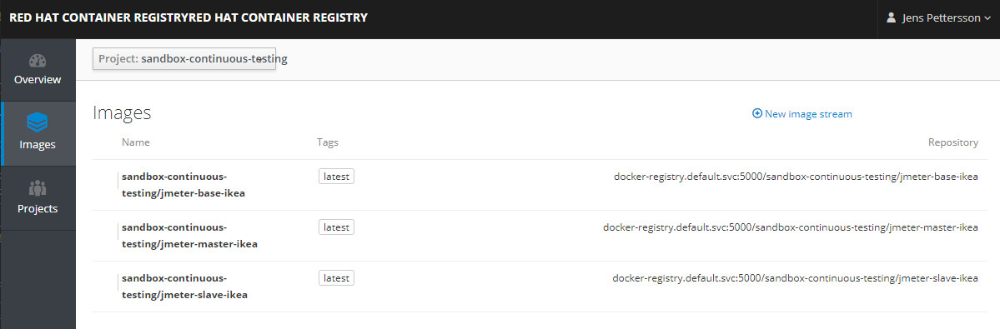

# Docker images

## Information and content

In openshift a docker registry exists but there is also something called Imagestreams which are the built containers existing as a stream. It is possible with additional settings to automatically trigger a build every time the image or it dependencies changes. Please be aware if this feature is enabled. <br />
Ikea Openshift environment has connection to internet and RedHat resources, but no connection to docker.io. This means all images stored in docker-io needs to be deployed or built in another way. In this project the [selenium image](https://github.com/SeleniumHQ/docker-selenium) is pulled locally and re-tagged to openshift. For Grafana and influxDB the docker images are pulled from [Redhat](https://catalog.redhat.com/software/containers/search). <br />
This folder contains three Dockerfiles for JMeter, a base dockerfile with all dpendencies and corresponfing and master/slave dockerfiles.

### Build JMeter Docker images

To be able to run JMeter or your apllication in OCP and in  Kubernetes engine we need to build and push Docker the image sto an imagestream.<br />
Login to Opens hift registry:<br /><br />

#### Using Jenkins

Use the corresponding buildconfig and Jenkins job for building and deploying images. See [config folder](../config/) for more information

#### Manual build

<br />

```
$ oc.exe login --token <your_login_token> ocm-02.ikeadt.com:8443
```
```
$ docker login -p <your_login_token> -u unused docker-registry-default.ocp-02.ikeadt.com
```

Please add the components needed [see base image](./Dockerfile-base-redhat) for your test (e.g, plugins, backendlisteners and test artifacts)<br />


PS: Go and grab a cop of coffe while the Base image is building <br />
Check that your images has been built<br /><br />


#### Push Docker images manually

Tou can use the corresponging Jenkins jobs for building or simple run it manually from shell (Use Powershell if Bash doesn't work)<br />
```
docker push docker-registry-default.ocp-02.ikeadt.com/${PROJECT_ID}/jmeter-master-ikea:latest
docker push docker-registry-default.ocp-02.ikeadt.com/${PROJECT_ID}/jmeter-slave-ikea:latest
```
Login to Open Shift control your images has been correctly uploaded: <br /><br />



Files and folders: <br />
- __Dockerfile-base-redhat__ : *RH7 + Java baseimage + Jmeter dependencies added from internet*
- __Dockerfile-master-selenium__ : *JMeter master image for remote selenium tests + additional files*
- __Dockerfile-master__ : *JMeter master image from Base imafe*
- __Dockerfile-slave__ : *JMeter slave image from Base image*
- __scripts__ : *Folder with scripts for local docker commands*
- __todo_app__ : *Example of deploying todo application (not used in this project)*
- __lib__ : *jar files to be included in the master selenium docker image*
