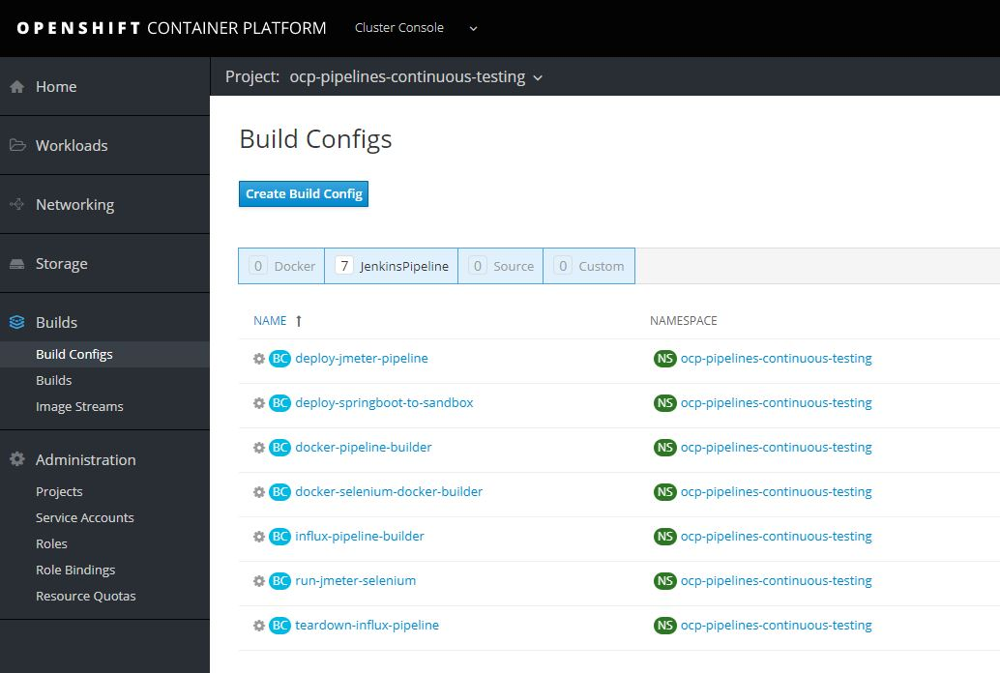
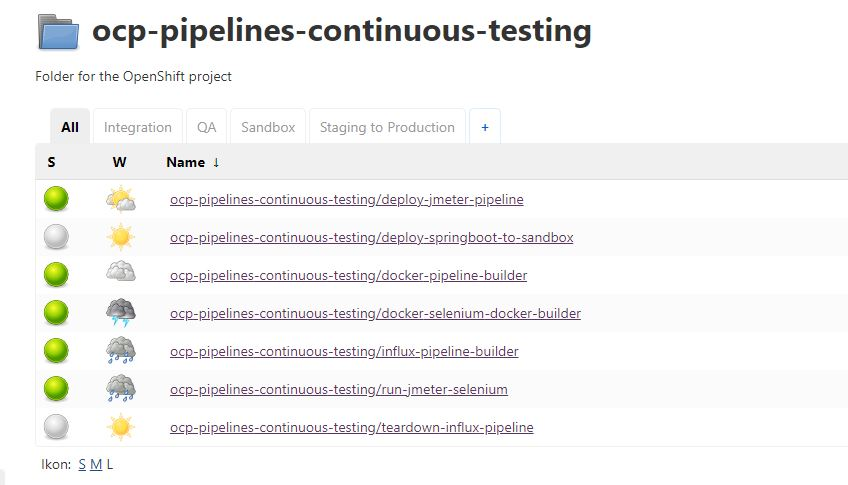

# Jenkins Buildconfiguration

This folder contains setup and buildconfiguration for Jenkins instances in Openshift.

## Filelist

- **jmeter_docker_buildconfig.yaml** 
    -  *jmeter_docker_Jenkinsfile.groovy* <br />
Buildconfig and Jenkinsfile for building JMeter images (Base, Master and Slave images).
- **run_jmeter_buildconfig.yaml**
    -  *run_jmeter_Jenkinsfile.groovy* <br />
Buildconfig and Jenkinsfile for running web API tests towards JMeter.
- **selenium_docker_buildconfig.yaml**
    -  *selenium_docker__Jenkinsfile.groovy* <br />
Buildconfig and Jenkinsfile for building JMeter master images, adding Webdriver packages for Selenium tests.
- **run_jmeter_selenium_buildconfig.yaml**
    -  *run_jmeter_selenium_Jenkinsfile.groovy* <br />
Buildconfig and Jenkinsfile for setup and running Selenium tests towards JMeter.
- **influx_setup_buildconfig copy.yaml**
    -  *influx_setup_Jenkinsfile.groovy* <br />
Buildconfig and Jenkinsfile for setting up InfluxDB and Grafana in Openshift.
- **influx_teardown_buildconfig.yaml**
    -  *influx_teardown_Jenkinsfile.groovy* <br />
Buildconfig and Jenkinsfile for tearing down InfluxDB and Grafana in Openshift.<br /><br />

NOTE: InfluxDB/Grafana and the persistent storafe needs to be stup first to run the JMX file examples. Please see [monitor folder](./openshift/monitor/) for more information. <br />
IPORTANT: Jenkins Job and the order to run them: <br />

**Setup monitoring:**<br />

1. influx-grafana-setup
2. influx-grafana-teardown (Optional to run, will remove Grafana)<br />

**Distribute testing JMeter:**<br />
1. jmeter-distributed-docker-builder
2. run-jmeter-distributed-test<br />

**Selenium testing JMeter:**<br />
1. selenium-docker-builder
2. run-jmeter-selenium-test<br /><br />


## Setup in Openshift

To setup communication to Github an SSH key is mandatory.<br /> Please [setup accesstoken](https://confluence.build.ingka.ikea.com/display/ICPW/Using+an+accesstoken+to+access+GitHub+Enterprise+repos) between Github and Openshift before proceeding. <br />The setup can be done manually from Openshift by pasting Buldconfiguration in the Jenkins pipeline project.<br /><br />
<br /><br />
And this will create corresponding Jenkins jobs<br /><br />
<br /><br />

### Setup Buildconfiguration from local CLI

It is an option to create the buildconfiguration and Jenkins setup by using CLI from your local computer.<br />
To be able to communicate with Openshift you need to [download and install oc CLI client](https://github.com/openshift/origin/releases) <br />
When it is installed you need to login by providing the API token:

```
oc login https://<cluster-address:443> --token=<your token>
```
When communication is verified with your cluster, it is possible to run following commands to setup Jenkins jobs -

```
oc create -n <your_jenkins_project_namespace> -f <your_buildconfig>.yaml

# Example script for this project
#!/usr/bin/env bash

namespace='ocp-pipelines-continuous-testing'

oc create -n $namespace -f jmeter_docker_buildconfig.yaml
oc create -n $namespace -f selenium_docker_buildconfig.yaml
oc create -n $namespace -f influx_setup_buildconfig.yaml
oc create -n $namespace -f run_jmeter_buildconfig.yaml
oc create -n $namespace -f run_jmeter_selenium_buildconfig.yaml
oc create -n $namespace -f influx_teardown_buildconfig.yaml

```
**IMPORTANT :** A namespace is given in the YAML file, it can be set during runtime and overriden by defining a variable as e.g. $(NAMESPACE)<br />
Please set the namespace (project) name to Jenkins instance before proceeding <br />
E.g. 
```
SNIP ...
metadata:
  labels:
    build: jmeter-distributed-docker-builder
  name: jmeter-distributed-docker-builder
  namespace: $(NAMESPACE)
spec:
...
```
The corresponding Jenkins groovy files are linked to the buildconfig files and will setup the Jenkins job automatically. 

## Variables

The most important variables to use is the NAMESPACE (project) and the TESTCASE variable (TEASTCASE variable decides which tests to be run) (see the run_jmeter_Jenkinsfile and run_jmeter_selenium_Jenkinsfile groovy-files ). <br />
Even of communication betwen namespaces are possible, the setup needs to be done in the same namespace to easily handle tests and communication.

### Improvements

Adding environment variables.